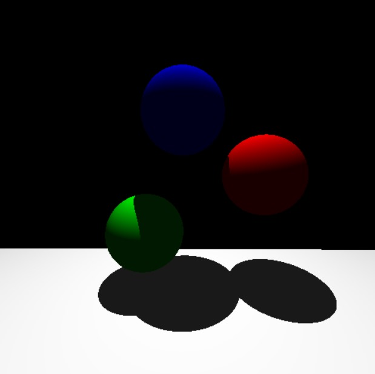

# Ray Casting

Este projeto é uma demonstração de ray casting usando OpenGL e GLUT em C++. Ele renderiza uma cena simples com esferas e um plano, permitindo movimentação básica da câmera.



## O que o código faz
O código implementa um ray caster que renderiza uma cena composta por esferas coloridas e um plano do tipo chão. A iluminação é calculada considerando a posição da fonte de luz e se há sombras lançadas por outros objetos. A câmera pode ser movimentada e girada usando o teclado para explorar a cena.

## Controles do teclado:
- **W/S**: Mover para frente/para trás.
- **A/D**: Mover para a esquerda/direita.
- **I/K**: Girar para cima/baixo.
- **J/L**: Girar para a esquerda/direita.
- **Espaço/X**: Movimentar para cima/baixo.

## Instruções para compilar e executar

### Dependências

GLUT e OpenGL

### Compilação e Execução

1. Clone este repositório e navegue até o diretório.

2. Compile os arquivos do projeto com o seguinte comando:

```
g++ vec3.cpp objeto.cpp esfera.cpp chao.cpp main.cpp -lGL -lGLU -lglut -o raycaster
```

3. Após a compilação, execute com:

```
./raycaster
```

Você pode controlar a câmera com os seguintes comandos:

- **W/S**: Mover para frente/para trás.
- **A/D**: Mover para a esquerda/direita.
- **I/K**: Girar para cima/baixo.
- **J/L**: Girar para a esquerda/direita.
- **Espaço/X**: Movimentar para cima/baixo.